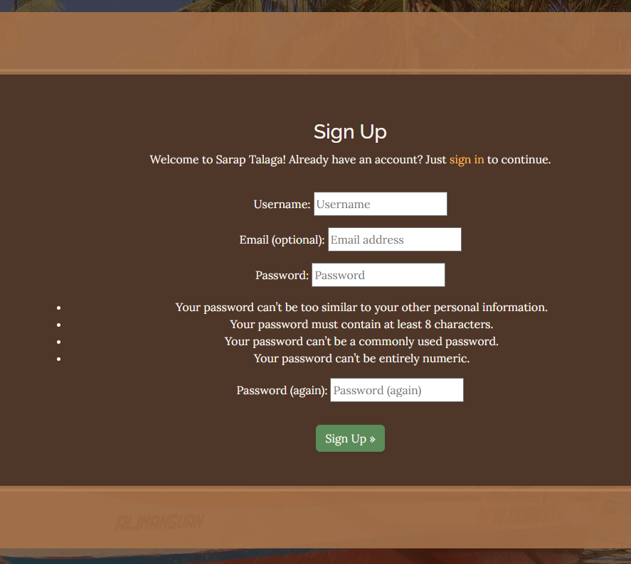
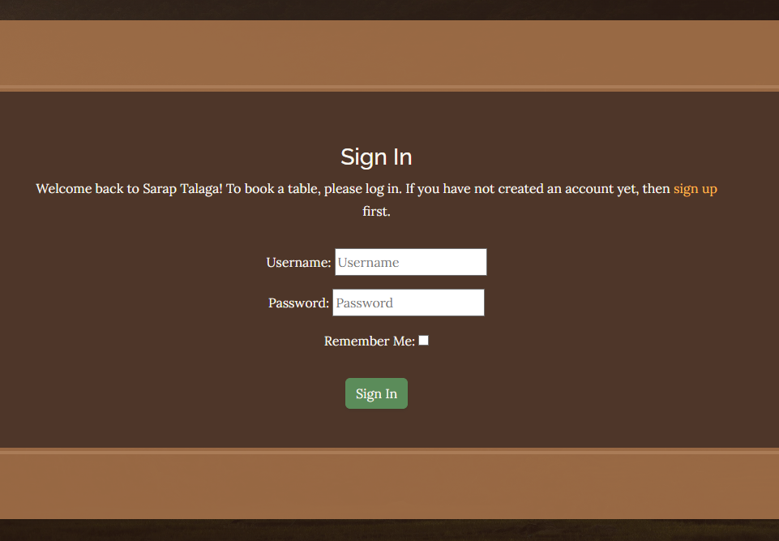
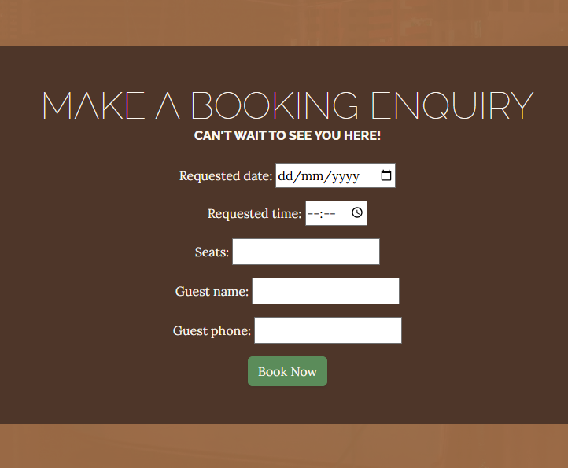
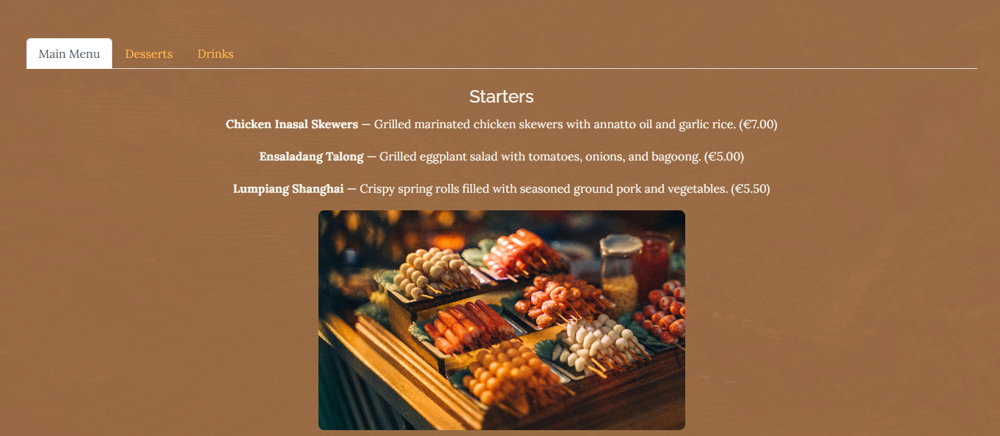
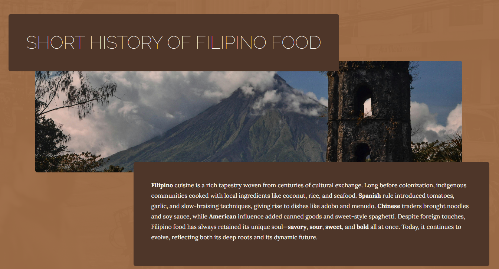
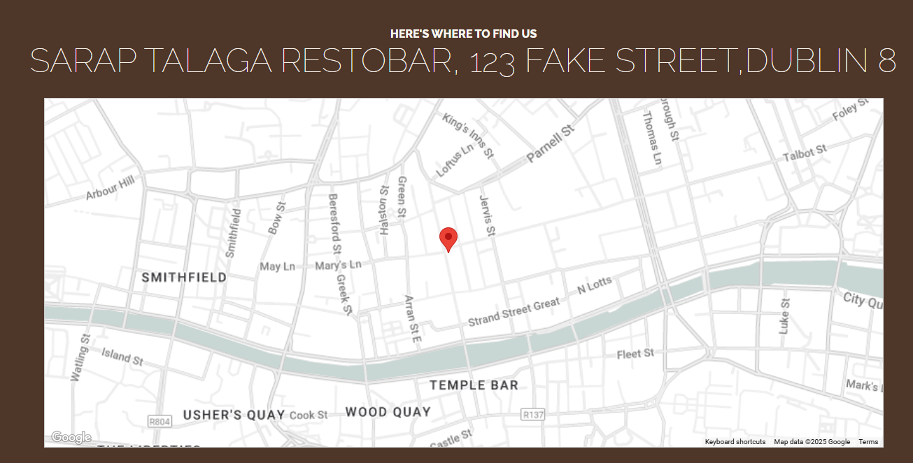
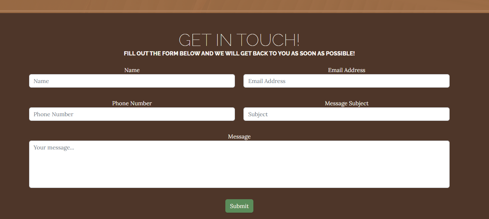

# Sarap Talaga! RestoBar

**Developer: Jehdil Dizon**

💻 [Visit live website](https://sarap-restobar-project4-ci-1e69f1c375a6.herokuapp.com/ )  
(Ctrl + click to open in new tab)

## Table of Contents
  - [About](#about)
  - [User Goals](#user-goals)
  - [Site Owner Goals](#site-owner-goals)
  - [User Experience](#user-experience)
  - [User Stories](#user-stories)
  - [Design](#design)
    - [Colours](#colours)
    - [Fonts](#fonts)
    - [Structure](#structure)
      - [Website pages](#website-pages)
      - [Database](#database)
    - [Wireframes](#wireframes)
  - [Technologies Used](#technologies-used)
  - [Features](#features)
  - [Validation](#validation)
  - [Testing](#testing)
    - [Manual testing](#manual-testing)
    - [Tests on various devices](#tests-on-various-devices)
    - [Browser compatibility](#browser-compatibility)
  - [Bugs](#bugs)
  - [Heroku Deployment](#heroku-deployment)
  - [Credits](#credits)
  - [Acknowledgements](#acknowledgements)

### About

Welcome to Sarap Talaga! RestoBar — a fictional Filipino restaurant.

Guests can easily log in to book a seat online or contact us directly if they prefer us to arrange a booking for them. Visitors can also explore what Sarap Talaga! is all about, view our lunch, dinner, and drinks menus, and find us easily using the interactive map on the site. 

### User Goals

- Book a table (choose how many people, date, time)
- Can view, update, delete booking
- View menus, blog, contact restaurant via contact form

### Site Owner Goals

- Allow users to book a table
- Get people to come to the restaurant
- Provide a website that is responsive, accessible, and intuitive to use

## User Experience

### Target Audience

- People who want to reserve a table for a couple, family, or friends
- Repeat customers 
- New customers (people new and visiting the area, locals, anyone looking to sample Filipino food)

### User Requirements and Expectations

- Intuitive & easy to use/navigate
- accessible
- welcoming and sleek themed design
- contact information & form
- location, opening hours

##### Back to [top](#table-of-contents)

## User Stories

### Users

1. As a site user I can open a menu so that I know what to order.

2. As a user I can go to the nav bar so that I can easily go to any section I want.

3. As a user I can go to about us section so that I can decide if i want to order here.

4. As a user I can go to the footer so that I can see any other useful info.

5. As a user I can book-a-table so that I can decide when I can go to the restaurant.

6. As a user I can contact the restaurant directly so that I can get my questions answered.

7. As a user I can open the site on different devices so that I can use whatever device is most convenient to me.

8. As a user I can login if I have an account so that I can make a booking.

9. As a user I can register for an account so that I can make a booking.

10. As a user I can know if I am logged in so that I know if I can order or if I need to register / login first.

11. As a user I can register so that I can make a booking.

12. As a user I can not book past dates so that my booking is valid.

13. As a user I can make changes so that i can update my booking.

14. As a user I can read my booking so that check the details on when it's booked, what time, and for how many seats.

15. As a user I can create a booking so that I can book seats for when i come.

16. As a user I can send a message on the contact form so that get the site admin to make the changes or if I have any questions.

.17. As a user I can get more information about the restaurant so that i can make an informed decision.

18. As a user I can clearly see which bookings are relevant to me so that I don't get mixed up.

### Admin / Authorised User

1. As a site admin I can update the menu so that I can sell new items / remove dishes that aren't selling well / if there is a deal.

2. As a site admin I can filter for bookings so that i can make edits to specific bookings if needed.

3. As a site admin I can add bookings manually if someone calls so that the customer can come and dine.

4. As an admin / a user with authorization I can enter the site in admin mode so that make edits, approve bookings, etc.

5. As a site admin I can use the search bar so that I can search for specific bookings if I know the name.

6. As a Site admin I can accept / reject so that double bookings are avoided.

7. As a site admin any changes I make sends an update to the customer so that they can know if their booking has been modified, accepted, rejected.

### Site Owner / Developer
1. As a Site developer I can create wireframes so that I have an idea what I want the finished site to look like.

2. As a site owner I can decide what type of restaurant so that I can decide on the themes & look of the page.

3. As a site developer I can create a base.html file so that creating new pages will be easily done using template inheritance.

4. As a site developer I can deploy the project so that I can determine if there are any issues early on.

5. As a site developer I can view READMe so that I can see the development of the site, verify testing, etc.

6. As a site developer I can create home page so that users get directed here when clicking on the restaurant link.

7. As a site developer I can create a logo so that there is a symbol that users can see to link back to the restaurant.

8. As a site developer I can view the relevant and code so that see how it is done.

### Kanban & Epics 
- User stories were tracked on Github Kanban feature 
- Epics were created using the milestones feature [Visit milestones](https://github.com/JedDizon/sarap-restaurant-project4/milestones)

Epics

Kanban

##### Back to [top](#table-of-contents)

## Design

### Colours

The color palette was carefully selected to reflect the essence of Filipino hospitality, heritage, and cuisine. The primary colors — Banana Leaf Green (#5B8C5A), Adobo Brown (#4E3629), and Coconut Husk (#A47149) — evoke a natural, grounded feeling reminiscent of tropical landscapes, traditional materials, and home-cooked meals. 

To complement this earthy foundation, vibrant accent colors like Mango Yellow (#FFB84C) and Chili Red (#C44536) were added to inject energy and highlight the vibrancy of Filipino culture. Taro Purple (#9D7CBF) offers a subtle nod to beloved local ingredients like ube, while Rice White (#FAF7F0) ensures a clean, welcoming canvas that enhances readability and warmth. Together, these colors create a palette that is rich, inviting, and deeply tied to Filipino identity.

### Structure

#### Website pages

The website was designed with user familiarity in mind, featuring a navigation bar at the top of each page and a hamburger menu for easy access on smaller screens.

The footer includes links to all relevant social media platforms, allowing users to easily follow the business online, helping to grow its digital presence. It also provides quick access to key pages such as About Us, Book a Table, Menus, Contact Information (phone, email, address), and Opening Hours.

- The site consists of the following pages:
 - Home
    - Links to Menu & Book a Table
    - Links to Menus
    - Link to About Us
 - Book Table
   - Link to Menu
   - Links to register / login to allow user to book
   - Book a Table functionality for registered users allowing them to book the number of seats, time, and date needed. Users can only book within opening hour times & cannot book past dates.
   - Logged in users can view current bookings & can update and cancel the booking details as needed.
 - Menu
    - Link to Book a Table
    - Display of Menus & all available food & drinks
 - About
    - Links to Menu & Book a Table
    - Blog about the restaurant, type of food, etc.
 - Location
    - Links to Menu & Book a Table
    - Address and interactive map showing how to find the restaurant
 - Contact Us
    - Links to Menu & Book a Table
    - Form for the user to fill out to send a direct message to the restaurant if they want admins to create/update/cancel a booking for them or if they have general questions
 -  Signup
    - Form for the user to register an account
 -  Login
    - Form for the user to login 
 - Logout
    - Form for the user to logout

#### Database

- Built with Python, Django & Postgres & deployed on Heroku.
- See below database models:

##### About Model
The About model contains the following:
- title
- updated_on
- content

##### Post Model
The Post Model contains the following:
- title
- slug
- author
- content
- created_on
- status
- excerpt
- updated_on
- Meta: ordering

##### Comment Model
The Comment Model contains the following:
- post (ForeignKey)
- author
- body
- approved
- created_on
- Meta: ordering

##### Book Model
The Book model contains the following:
- title
- updated_on
- content

##### Reservation Model
The Reservation model contains the following:
- user
- guest_name
- guest_phone
- created_date
- requested_date
- requested_time
- seats
- status
- updated_on

##### Contact Model
The Contact model contains the following:
- title
- updated_on
- content

##### Location Model
The About model contains the following:
- title
- updated_on
- content

##### Menu Model
The Menu model contains the following:
- title
- updated_on
- content

### Wireframes

Wireframes created using Balsamiq

Home

Booking

Menus

About Us

Location

Contact Us

Register/Login/Logout

## Technologies Used

### Languages & Frameworks

- CSS
- Django
- HTML
- Javascript
- Python

### Libraries & Tools

- [Multi Device Website Mockup Generator](https://techsini.com/multi-mockup/)
- [Balsamiq](https://balsamiq.com/)
- [Bootstrap v5.2](https://getbootstrap.com/)
- [Cloudinary](https://cloudinary.com/)
- [Favicon.io](https://favicon.io)
- [Chrome dev tools](https://developers.google.com/web/tools/chrome-devtools/)
- [Font Awesome](https://fontawesome.com/)
- [Git](https://git-scm.com/)
- [GitHub](https://github.com/)
- [Google Fonts](https://fonts.google.com/)
- [Heroku Platform](https://id.heroku.com/login)
- [Postgres](https://www.postgresql.org/)
- [Start Bootstrap](https://startbootstrap.com)
- [Summernote](https://summernote.org/)
- [jQuery](https://jquery.com)
- Validation:
  - [WC3 Validator](https://validator.w3.org/)
  - [Jigsaw W3 Validator](https://jigsaw.w3.org/css-validator/)
  - [JShint](https://jshint.com/)
  - [CI Python Linter (PEP8)](https://pep8ci.herokuapp.com/)
  - [Lighthouse](https://developers.google.com/web/tools/lighthouse/)
  - [Wave Validator](https://wave.webaim.org/)

##### Back to [top](#table-of-contents)

## Features
## Features

### Logo & Nav Bar
- Custom logo
- Navbar links to other pages
- Navbar is responsive by switching to a burger-style menu 
- displayed on all pages
- if user is logged in, a message is displayed above the nav bar to let users know if their login status.

See feature images

### Footer
- Contains contact details (phone, email, address), quick links to about us, book table, menu pages, opening hours, links to social links
- displayed across all pages

See feature images

### Reminder links
- Below the nav bar on most pages have reminder links to bring users to the menu & book a table pages
- also exists above the footer on most pages

See feature images

### Signup
- Users can input details to create an account

See feature images

### Login
- Users can login to allow them to create, read, update, or delete their bookings.

See feature images

### Logout
- Lets users logout
- Users must confirm if they want to logout

See feature images

### Book
- Book form allows users to book a table by specifying a requested date, time, seats, guest name, phone.
- site prompts users if input is not accepted i.e. time outside opening hours. 
- Booking form does not show us if user is not authenticated. Instead, a message is shown with links to register an account or login. 

See feature images

### Your Reservations
- When logged in, users can view their current reservations below the booking form.
- States the choices users picked when booking, and status of the booking.
- users can edit & cancel their booking.
- declined bookings auto delete after 5 days, & approved bookings auto delete 5 days after the requested date. 
- bookings are ordered by updated date.

See feature images

### Menus
- Menus are split into an accordion style selection box.
- Users can choose between the Main, Desserts, Drinks menus.
- Menu items can be created, updated, deleted through the admin panel by the staff or someone with access.
  

See feature images

### About us
- Read more link on the home page redirects users to the about-us page.
- On about about-us page, 3 small blogs can be read by the user to find out more about the story of the restaurant & what is filipino food.
- there is a small image gallery above the footer to showcase Filipino culture.

  

See feature images

### Location
- shows the address & interactive map showing where the restaurant can be found.
- shows an updating opening hours table is below the map to allow users to make clearer decisions on when the restaurant is open

See feature images

### Contact Us
- Users can input their details (name, email, phone, message) to contact restaurant admins.
- Submitting a message sends a message to the user’s input email address telling them that the restaurant will get back to the users when they can.
  

See feature images

##### Back to [top](#table-of-contents)

## Validation

### Nu HTML Checker

Home

Table Booking

Menus

About Us

Location

Contact Us

Register

Login

Logout

### CSS Validation

Only 1 error found. No concern. CSS from startbootstrap.

Style.css

### JavaScript Validation

Tested using JSHint.
Contact: OK. "emailjs" & "sendMail" variables being used.
Location: OK. "marker" used.
Menu: OK. "openTab" used.

booking.js

contact.js

location.js

menu.js

script.js

### PEP8 Validation

### Lighthouse

Lighthouse used to test performance, accessibility, best practices, and SEO. Main issue is low score for location page on phone. Likely due to the map. 

#### Desktop

Home

Book

Menu

About

Location

Contact

Register

Login

Logout

#### Mobile

Home

Book

Menu

About

Location

Contact

Register

Login

Logout

### Wave

Wave was used to test website accessability.
Only page of note was the Contact Us page with contrast errors. 
Deemed ok via Color Contrast Checker ([Coolors](https://coolors.co/contrast-checker/faf7f0-4e3629)). 

Home

Book

Menus

About

Location

Contact

Register

Login

##### Back to [top](#table-of-contents)

## Testing

### Manual testing

1. Home page

| TEST                   | ACTION                                | EXPECTATION                              | RESULT    |
|------------------------|---------------------------------------|------------------------------------------|-----------|
| **Homepage loads**   | User opens site link | Site loads | **Success** |
| **Menu link in hero works**   | User clicks on menu link | Brings user to menu page | **Success** |
| **Book link in hero works**   | User clicks on booklink | Brings user to booking page | **Success** |
| **Menus links bring user to correct menu section**   | User clicks on a menu link (Main/Dessert/Drinks) | Brings user to correct menu section on menu page | **Success** |
| **Shortcut link to about us page works**   | User clicks on about us link to find out more | Brings user to about us page | **Success** |
| **Menu link in reminder section works**   | User clicks on menu link | Brings user to menu page | **Success** |
| **Book link in reminder section works**   | User clicks on booklink | Brings user to booking page | **Success** |

2. Nav bar

| TEST                   | ACTION                                | EXPECTATION                              | RESULT    |
|------------------------|---------------------------------------|------------------------------------------|-----------|
| **Home link in nav bar**   | User clicks on Home link | Brings user to Home page | **Success** |
| **Logo link**   | User clicks on Logo link | Brings user to Home page | **Success** |
| **Table booking link in nav bar**   | User clicks on Table booking link | Brings user to Table booking page | **Success** |
| **Menus link in nav bar**   | User clicks on Menus link | Brings user to Menus page | **Success** |
| **About us link in nav bar**   | User clicks on About us link | Brings user to About us page | **Success** |
| **Location link in nav bar**   | User clicks on Location link | Brings user to Location page | **Success** |
| **Contact Us link in nav bar**   | User clicks on Contact Us link | Brings user to Contact Us page | **Success** |
| **Register link in nav bar**   | User clicks on Register link | Brings user to Register page | **Success** |
| **Login link in nav bar**   | User clicks on Login link | Brings user to Login page | **Success** |
| **Logout link in nav bar**   | User clicks on Login link | Brings user to Login page | **Success** |
| **Login status**   | User logs in | Message on nav bar displays user login status | **Success** |

3. Footer

| TEST                   | ACTION                                | EXPECTATION                              | RESULT    |
|------------------------|---------------------------------------|------------------------------------------|-----------|
| **About us link in footer**   | User clicks on About us link | Brings user to About us page | **Success** |
| **Book table link in footer**   | User clicks on Book table link | Brings user to Book table page | **Success** |
| **Menus link in footer**   | User clicks on Menus link | Brings user to Menus page | **Success** |
| **Facebook link in footer**   | User clicks on Facebook logo in Socials section of footer | Facebook link opens in a new tab | **Success** |
| **X link in footer**   | User clicks on X logo in Socials section of footer | X link opens in a new tab | **Success** |
| **Instagram link in footer**   | User clicks on Instagram logo in Socials section of footer | Instagram link opens in a new tab | **Success** |
| **TikTok link in footer**   | User clicks on TikTok logo in Socials section of footer | TikTok link opens in a new tab | **Success** |

4. Table Booking

| TEST                   | ACTION                                | EXPECTATION                              | RESULT    |
|------------------------|---------------------------------------|------------------------------------------|-----------|
| **Prompt shows if user is not logged in**   | User tries to book without being logged in | Prompt is in place of booking form asking user to login or register | **Success** |
| **Link to register**   | User clicks on register link in prompt | Brings user to register page | **Success** |
| **Link to login**   | User clicks on login link in prompt | Brings user to login page | **Success** |
| **Booking form shows if user is logged in**   | User goes to booking form while logged in | Booking form is visible | **Success** |
| **Old dates can’t be chosen**   | User tries to book a past date | User cannot click on past dates | **Success** |
| **Times outside booking hours can’t be chosen**   | User tries to book a time outside opening hours  | Message prompts user to choose a valid time & they can’t submit | **Success** |
| **User must add how many seats to book**   | User must add how many people the booking is for | User cannot submit if seats not specified | **Success** |
| **User can view their bookings**   | User views their bookings| User can view their bookings | **Success** |
| **User can update their bookings**   | User clicks on Edit to update their bookings| User can Edit their bookings | **Success** |
| **Edit form works same as initial booking form**   | User updates their booking  | Edit booking form have same validation (No old dates, must choose within opening hours, must choose seats) | **Success** |
| **Cancel booking confirmation**   | User clicks on Delete booking  | Confirmation pops up for user to confirm first | **Success** |
| **User can delete booking**   | User deleted booking  | Booking is deleted | **Success** |
| **Approved Booking clean up**   | Approved booking exists 5 days after requested date  | Booking is auto removed from reservations list | **Success** |
| **Declined Booking clean up**   | Declined booking exists 5 days after being declined  | Booking is auto removed from reservations list | **Success** |

5. Menus

| TEST                   | ACTION                                | EXPECTATION                              | RESULT    |
|------------------------|---------------------------------------|------------------------------------------|-----------|
| **Menus links bring user to correct menu section**   | User clicks on a menu link (Main/Dessert/Drinks) | Brings user to correct menu section on menu page | **Success** |
| **User can manually choose a menu in menu section**   | User clicks on a menu header | Relevant menu opens | **Success** |

6. About Us

| TEST                   | ACTION                                | EXPECTATION                              | RESULT    |
|------------------------|---------------------------------------|------------------------------------------|-----------|
| **Blogs Load**   | User goes to About us page | User can read blogs | **Success** |
| **Image gallery**   | User goes to gallery section | User can view the images | **Success** |

7. Location

| TEST                   | ACTION                                | EXPECTATION                              | RESULT    |
|------------------------|---------------------------------------|------------------------------------------|-----------|
| **Google maps restaurant location**   | User moves the map | User can interact with the map | **Success** |
| **Map functionality on phone**   | User moves the map on mobile | User can interact with the map | **Success** |
| **Opening hours update**   | User can check when is opening hours on the day | Opening hours table update to showcase opening hours of a specific day | **Success** |

8. Contact Us

| TEST                   | ACTION                                | EXPECTATION                              | RESULT    |
|------------------------|---------------------------------------|------------------------------------------|-----------|
| **Contact form**   | User sends a direct message to restaurant admins | User sends a direct message to restaurant email | **Success** |
| **User submits an incomplete empty form**   | User attempts to send an empty/incomplete form form | Fails. Form does not submit | **Success** |
| **User phone number**   | User submits a form that has a phone number with letters or really long | Form does not submit | **Success** |
| **Email confimation**   | User submits a complete form | Input email gets sent a notification email of the recieved message | **Success** |

9. Register / Login / Logout

| TEST                   | ACTION                                | EXPECTATION                              | RESULT    |
|------------------------|---------------------------------------|------------------------------------------|-----------|
| **Register**   | User clicks on register link | User is brought to a registration form | **Success** |
| **Registration form validation**   | User fills out form  | User must fill out the form with a username and password  | **Success** |
| **Unique username**   | User fills out form with a used username  | Registration fails with a message to select a unique username  | **Success** |
| **User login**   | User enters username and password  | User logs in | **Success** |
| **Logout confirmation**   | User clicks on logout link in navbar | User is brought to a confirmation page if they want to logout | **Success** |
| **Logout function**   | User confirms that they want to logout | User is logged out | **Success** |

10. Admin

| TEST                   | ACTION                                | EXPECTATION                              | RESULT    |
|------------------------|---------------------------------------|------------------------------------------|-----------|
| **Create blog**   | Admin can creates a blog | Blog is created | **Success** |
| **Update blog**   | Admin can update a blog | Blog is updated | **Success** |
| **Read blog**   | Admin can Read a blog | Blog is read| **Success** |
| **Delete blog**   | Admin can Delete a blog | Blog is Deleted| **Success** |
| **Create menu item**   | Admin can create a menu item | Menu item is created | **Success** |
| **Read menu item**   | Admin can Read a menu item | Menu item is Read| **Success** |
| **Update menu item**   | Admin can Update a menu item (name, price, description) | Menu item is updated| **Success** |
| **Delete menu item**   | Admin can Delete a menu item | Menu item is Deleted| **Success** |
| **Booking approval**   | Admin approves booking | Booking is approved | **Success** |
| **Booking decline**   | Admin declines booking | Booking is declined| **Success** |
| **Manual booking creation**   | Admin creates booking manually for customer | Booking is created| **Success** |
| **Manual booking update**   | Admin updates booking manually for customer | Booking is updated| **Success** |

<Admin>

### Device Testing & Browser compatibility

##### Back to [top](#table-of-contents)

## Bugs

| **Bug** | **Fix** |
| ------- | ------- |
| CSS not loading properly | Bootstrap CSS not properly connected via Jinja template |
| Footer items not stacking on smaller screen sizes | |
| Logo & title not spacing correctly | Incorrect use of bootstrap cols |
| Can't reload the page after making an update or deletion or create a form | Use redirect after processing POST to prevent form resubmission |
| Message “Update successful” keeps showing | Changed to use alert message instead |
| Could not load blogs on about app | Did not update jinja template load view name |
| User can submit an empty contact form| Added validation to contact js to check and enforce users filling the form fully out before it can be sent |
| User can input non numbers for phone number section on contact form | Added validation ot contact js to not accept phone numbers that include letters and limited the phone length with min and max |
| User can't submit contact form if initial submission was incorrect| Added js to clear previous validation message when user starts typing |
| New blogs override current blogs, want to be able to choose which blogs are active| |
| Deployment loading timeout error preventing site from opening properly after deploying on Heroku | Added timeout to procfile & added database to vars |

##### Back to [top](#table-of-contents)

### Heroku Deployment

[Official Page](https://devcenter.heroku.com/articles/git) (Ctrl + click)

This application has been deployed from Github using Heroku. Here's how:

1. Create an account at heroku.com

2. Create an app, give it a name for such as ci-pp4-the-diplomat, and select a region

3. Under resources search for postgres, and add a Postgres database to the app

Heroku Postgres

1. Note the DATABASE_URL, this can be set as an environment variable in Heroku and your local deployment(env.py)

2. Install the plugins dj-database-url and psycopg2-binary.

3. Run pip3 freeze > requirements.txt so both are added to the requirements.txt file

4. Create a Procfile with the text: web: gunicorn the_diplomat.wsgi

5. In the settings.py ensure the connection is to the Heroku postgres database, no indentation if you are not using a seperate test database.
I store mine in env.py

6. Ensure debug is set to false in the settings.py file

7. Add localhost, and ci-pp4-the-diplomat.herokuapp.com to the ALLOWED_HOSTS variable in settings.py

8. Run "python3 manage.py showmigrations" to check the status of the migrations

9. Run "python3 manage.py migrate" to migrate the database

10. Run "python3 manage.py createsuperuser" to create a super/admin user

11. Run "python3 manage.py loaddata categories.json" on the categories file in products/fixtures to create the categories

12. Run "python3 manage.py loaddata products.json" on the products file in products/fixtures to create the products

13. Install gunicorn and add it to the requirements.txt file using the command pip3 freeze > requirements.txt

14. Disable collectstatic in Heroku before any code is pushed using the command heroku config:set DISABLE_COLLECTSTATIC=1 -a ci-pp4-the-diplomat

15. Ensure the following environment variables are set in Heroku

16. Connect the app to GitHub, and enable automatic deploys from main if you wish

17. Click deploy to deploy your application to Heroku for the first time

18. Click on the link provided to access the application

19. If you encounter any issues accessing the build logs is a good way to troubleshoot the issue

### Fork Repository
Follow the below steps to fork the repository:
1. Go to the GitHub repository
2. Click on Fork button in upper right hand corner

### Clone Repository
Follow the below steps to clone the repository:
1. Go to the GitHub repository 
2. Locate the Code button above the list of files and click it 
3. Select if you prefer to clone using HTTPS, SSH, or Github CLI and click the copy button to copy the URL to your clipboard
4. Open Git Bash
5. Change the current working directory to the one where you want the cloned directory
6. Type git clone and paste the URL from the clipboard ($ git clone https://github.com/YOUR-USERNAME/YOUR-REPOSITORY)
7.Press Enter to create your local clone.

##### Back to [top](#table-of-contents)

## Credits

### Images

Images used were sourced from Pexels.com, Wikimedia Commons and AI image generator (pyxl.pro) was used for logo & favicon with the permission from OpenAI.

### Code

StartBootstrap template “Business Casual used for the site: (https://startbootstrap.com/theme/business-casual)

Google maps API for locations:
(https://www.youtube.com/watch?v=6Tl3ROOgvgw) 

CI projects:
Resume
Using emailjs API
Flask Dwarves
Using StartBootstrap 
Blog
Creating a django app
Using fixtures
Creating a blog with comments
Authentication
How to deploy to Heroku

Bootstrap classes:
Menu cards
Footer info sections

READMe template: https://github.com/ArronBeale/CI_PP4_the_diplomat?tab=readme-ov-file 

##### Back to [top](#table-of-contents)

## Acknowledgements

### Special thanks to the following:
- Code Institute
- Mo Shami

